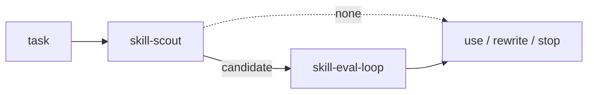
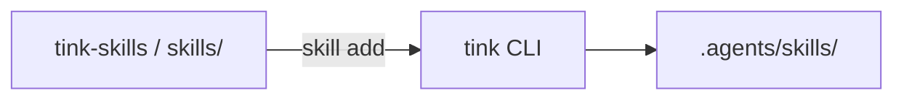

# tink-skills

Scout what fits. Measure if it moves anything.

Local evidence under project `.agents/skills/` — not a claim the skill wins
everywhere. Install with [tink](https://github.com/jon-devlapaz/tink).



## Install

```console
cargo install --git https://github.com/jon-devlapaz/tink.git --locked

tink init --with-tink-skills
tink skill list
tink skill check
```

One skill at a time:

```console
tink skill add jon-devlapaz/tink-skills --skill skill-scout
tink skill add jon-devlapaz/tink-skills --skill skill-eval-loop
tink skill add jon-devlapaz/tink-skills --skill triangulate-me
```

Refresh clean imports: `tink skill refresh` (or name one skill). Source may be a
local path or `--stash`. Do not hand-edit `.tink-source.json` receipts.

## First success

Both skills are agent workflows. Point your coding agent at the project (with
skills under `.agents/skills/`) and try:

**Scout — find a fit (read-only until you approve install):**

```text
Use skill-scout to find a maintained skill for reviewing database migrations.
```

You should get a best-supported choice or an honest abstain, with evidence and a
named next gate. Scout does not install by itself.

**Eval — local with/without skill signal:**

```text
Use skill-eval-loop to test this skill against a no-skill control.
Dry-run first, then ask me before any paid pilot.
```

You should get a budget, a dry-run plan that wrote nothing, and after you approve
a pilot, local paired results (control vs skill) with integrity/claim limits —
not a “wins everywhere” trophy.

## skill-scout

Research-only ranking under constraints (workflow fit, safety, demonstrated
behavior, and related gates). Modes: COMPARE, VERIFY, DISCOVER, or ABSTAIN/BUILD.
DISCOVER inventories active project skills and the Tink library first, presents
at most three qualified local candidates, then separately asks whether to pursue
one and whether to search online. Authorized online discovery checks the first
applicable structured source before evidence-triggered GitHub and general-web
expansion. Cross-project catalog history is optional. Detail:
[skills/skill-scout/SKILL.md](skills/skill-scout/SKILL.md).

## skill-eval-loop

Paired diagnostic under Hermes, Claude Code, Codex, or Pi: same task, skill on
vs off. One question at a time; dry-run free; live runs wait for your invocation
budget. Missing suites can be authored in a fresh subagent so cases stay sealed.
Claim boundaries:
[skills/skill-eval-loop/references/interpret-benchmark.md](skills/skill-eval-loop/references/interpret-benchmark.md).
Full contract: [skills/skill-eval-loop/SKILL.md](skills/skill-eval-loop/SKILL.md).

## triangulate-me

Iterative interpretation under pressure: restate the user's actual commitment,
construct its strongest and weakest still-plausible readings, identify the
crux, and recommend a convergence without manufacturing a straw man or false
compromise. Full contract:
[skills/triangulate-me/SKILL.md](skills/triangulate-me/SKILL.md).

## Model

Each package is `SKILL.md` plus relative resources
([Agent Skills](https://agentskills.io/specification) shape). Optional
`agents/openai.yaml` is Codex UI metadata.



Published tree: this repo. Day-to-day live copy: `.agents/skills/<name>/`.

## Advanced

### Run eval scripts yourself

When you are not driving the agent loop:

```console
export SKILL_EVAL_DIR="$PWD/.agents/skills/skill-eval-loop"

python3 "$SKILL_EVAL_DIR/scripts/audit_suite.py" \
  --skill-path "$PWD/.agents/skills/target-skill"

python3 "$SKILL_EVAL_DIR/scripts/run_skill_eval.py" \
  --skill-path "$PWD/.agents/skills/target-skill" \
  --harness selected-harness \
  --model exact-provider/model-id \
  --trials 1 \
  --dry-run
```

Optional flags: `--judge-model`, `--observer herdr`, `--evals-path`. Revalidate:
`aggregate_benchmark.py --run-dir …`. Artifact default under
`.agents/.eval-runs/` when skills live in `.agents/skills`.

### Promote live edits into this repo

```console
python3 tools/promote_live_skill.py --skill skill-eval-loop \
  --live-root .agents/skills
python3 tools/promote_live_skill.py --skill skill-eval-loop \
  --live-root .agents/skills --apply
```

Does not stage, commit, or delete repository-only files. Then:

```console
tink skill add . --skill skill-eval-loop
tink skill check
```

## Layout

```text
.
├── skills/skill-scout/
├── skills/skill-eval-loop/
├── skills/triangulate-me/
├── tools/
├── tests/
└── .github/workflows/
```

Three published skill packages (CI enforces the count).

## Develop

```console
python3 -m unittest tests/test_promote_live_skill.py -v
bash skills/skill-eval-loop/scripts/healthcheck.sh
python3 -m ruff check tools tests skills/skill-eval-loop/scripts skills/skill-eval-loop/tests
```

CI: [validate.yml](.github/workflows/validate.yml).

## License

[MIT](LICENSE).
