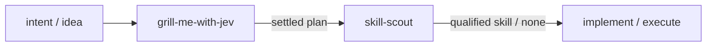

# tink-skills

Evidence-oriented Agent Skills:

- **skill-scout** finds and qualifies existing agent skills before another one is created.
- **grill-me-with-jev** grills a plan through consequential decisions and failure modes, using TypeSafe Jev to advise whether to ask, investigate, or continue.

*(Note: `triangulate-me` has been deprecated and superseded by `grill-me-with-jev` for decision-tree interrogation and grounded planning).*



## Install

Install the skills from this repository with [Tink](https://github.com/jon-devlapaz/tink):

```console
tink skill add jon-devlapaz/tink-skills --skill grill-me-with-jev
tink skill add jon-devlapaz/tink-skills --skill skill-scout
```

Refresh an installed skill with `tink skill refresh NAME`.

---

## grill-me-with-jev

`grill-me-with-jev` stress-tests an engineering or architectural plan through an interactive decision tree interview:
- **Attention discipline:** Resolves inspectable repository facts autonomously before interrupting the user; reserves questions for consequential user authority and judgment.
- **Triage gatekeeper (Jev advisory):** Uses TypeSafe Jev to advise whether a concern should *ask now*, *investigate first*, or *continue without asking*.
- **Formal DAG frontier:** Tracks decision nodes with discrete states (`unresolved`, `settled`, `deferred`, `superseded`), handles cycles, and cascades invalidations cleanly when parent assumptions change.
- **Anti-laziness stopping gate:** Evaluates candidate omissions via Jev `Noul` (`probability > 0.80`) to reject premature session termination.
- **Durable plan artifact:** Upon final user confirmation, saves the agreed plan to `grill-plan.md` without authorizing unprompted code modifications.

Full contract: [`skills/grill-me-with-jev/SKILL.md`](skills/grill-me-with-jev/SKILL.md)
Operational reference: [`skills/grill-me-with-jev/references/triage-patterns.md`](skills/grill-me-with-jev/references/triage-patterns.md)
Evaluation suite: [`skills/grill-me-with-jev/evals/evals.json`](skills/grill-me-with-jev/evals/evals.json)
Measurement experiments: [`eval guide`](skills/grill-me-with-jev/evals/README.md) · [`results and limits`](docs/reviews/grill-me-with-jev-experiments.md)

---

## skill-scout

`skill-scout` discovers, qualifies, and recommends existing skills before authoring a new one:
- **Lightest-mode selection** across `COMPARE`, `VERIFY`, and `DISCOVER`.
- **Read-only candidate inspection** without unsanctioned code execution.
- **6-point qualification gate** (workflow fit, non-redundancy, safety/provenance, compatibility, maintenance, demonstrated behavior).
- **Structured 7-field reporting** with verified published descriptions, runner-up gap analysis, and explicit gated next actions.
- **Experimental Jev fit decisions:** Optional helper using TypeSafe Jev for workflow-fit qualification under frozen evaluation policies.

Full contract: [`skills/skill-scout/SKILL.md`](skills/skill-scout/SKILL.md)
Jev fit reference: [`skills/skill-scout/references/jev-fit.md`](skills/skill-scout/references/jev-fit.md)

---

## Repository Structure

```text
.
├── docs/
│   ├── intent/          # Stage 1: Problem statements & goals
│   ├── specs/           # Stage 2: Functional specifications (R1-R10)
│   ├── plans/           # Stage 3: Implementation plans
│   └── reviews/         # Stage 5: Verification & evaluation reports
├── skills/
│   ├── grill-me-with-jev/
│   └── skill-scout/
└── tests/               # Python contract and Jev-fit tests
```

---

## Develop & Test

Run the full test suite locally:

```console
python3 -m unittest discover -s tests -v
```

## License

[MIT](LICENSE).