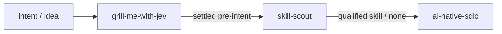

# tink-skills

Evidence-oriented Agent Skills for AI coding workflows:

- **grill-me-with-jev** — Pressure-tests your engineering plan through a step-by-step interview, resolving facts in the codebase first and asking one consequential decision at a time.
- **skill-scout** — Finds, inspects, and qualifies existing agent skills before you build a new one.
- **ai-native-sdlc** — Runs an evidence-based software development lifecycle with stage contracts, verified test receipts, and test locks.

*(Note: `triangulate-me` has been deprecated and superseded by `grill-me-with-jev` for decision-tree interrogation and grounded planning).*



## Install

Install the skills from this repository with [Tink](https://github.com/jon-devlapaz/tink):

```console
tink skill add jon-devlapaz/tink-skills --skill grill-me-with-jev
tink skill add jon-devlapaz/tink-skills --skill skill-scout
tink skill add jon-devlapaz/tink-skills --skill ai-native-sdlc
```

Refresh an installed skill with `tink skill refresh NAME`.

---

## grill-me-with-jev

`grill-me-with-jev` stress-tests your architectural plan or technical decision through a focused, single-question interview before you write code.

### How it works
- **Investigates facts first:** Checks repository code, configs, and schemas before asking you anything. If a fact is discoverable, it won't interrupt you for it.
- **One decision at a time:** Paces questions one by one with a clear recommendation grounded in workspace evidence, keeping cognitive load low.
- **Advisory triage (TypeSafe Jev):** Consults Jev to gauge whether a concern needs your judgment now, needs more investigation, or can proceed safely.
- **Durable discovery artifact:** Once all blockers are resolved and confirmed, writes the accepted plan to `pre-intent.md` as intake for downstream implementation.

### Interview format

```text
Decision 1 of 3 ready (2 parked)
❓ Q1 — Decision: Consequence or tradeoff requiring your judgment.
➡️ Recommended: Evidence-grounded option.
⚡️ Jev triage: ask now · 0.85 probability
```

Full contract: [`skills/grill-me-with-jev/SKILL.md`](skills/grill-me-with-jev/SKILL.md)  
Operational references: [`ledger-transitions.md`](skills/grill-me-with-jev/references/ledger-transitions.md) · [`typesafe-protocol.md`](skills/grill-me-with-jev/references/typesafe-protocol.md)

---

## skill-scout

`skill-scout` finds and qualifies existing agent skills before you author a new one from scratch.

### How it works
- **Targeted search:** Looks across GitHub and community registries for existing solutions.
- **Read-only inspection:** Evaluates candidate source code, licenses, and dependencies safely without executing arbitrary code.
- **Clear verdict:** Grades candidates across fit, maintenance, and safety, returning a concrete recommendation (adopt, adapt, or build new).

Full contract: [`skills/skill-scout/SKILL.md`](skills/skill-scout/SKILL.md)  
Jev fit reference: [`skills/skill-scout/references/jev-fit.md`](skills/skill-scout/references/jev-fit.md)

---

## ai-native-sdlc

`ai-native-sdlc` installs and operates an evidence-based software development lifecycle inside your repository.

### How it works
- **Structured stages:** Guides work through Plan, Design, Build, Test, Deploy, and Maintain.
- **Flexible profiles:** Use `light` (a single reviewed brief) for routine tasks, or `full` (intent, spec, and plan) for consequential architecture.
- **Evidence-backed gates:** Advances stages using verified test receipts and content hashes so progress is provable, not assumed.
- **Safe scaffolding:** Easily installed via `scripts/init.py` without overwriting existing repo instructions.

Full contract: [`skills/ai-native-sdlc/SKILL.md`](skills/ai-native-sdlc/SKILL.md)  
Operator manual: [`skills/ai-native-sdlc/assets/_system/SDLC.md`](skills/ai-native-sdlc/assets/_system/SDLC.md)

---

## Repository Structure

```text
.
├── docs/
│   ├── intent/          # Problem statements & goals
│   ├── specs/           # Functional specifications
│   ├── plans/           # Implementation plans
│   └── reviews/         # Verification & evaluation reports
├── skills/
│   ├── ai-native-sdlc/
│   ├── grill-me-with-jev/
│   └── skill-scout/
└── tests/               # Python contract and Jev-fit tests
```

---

## Develop & Test

Run the full test suite locally:

```console
python3 -m unittest discover -s tests -v
```

## License

[MIT](LICENSE).