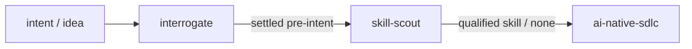

# tink-skills

Evidence-oriented Agent Skills for AI coding workflows:

- **interrogate** — Pressure-tests your engineering plan through a step-by-step interview, resolving facts in the codebase first and asking one consequential decision at a time.
- **skill-scout** — Finds, inspects, and qualifies existing agent skills before you build a new one.
- **ai-native-sdlc** — Runs an evidence-based software development lifecycle with stage contracts, verified test receipts, and test locks.
- **skill-gate** — Statically extracts feature vectors, profiles execution risk, and evaluates harness compatibility for agent skills.
- **triage-issues-with-jev** — Clusters your own open issues and recommends accept or deny. Read-only unless you explicitly grant GitHub writes.



## Install

Install the skills from this repository with [Tink](https://github.com/jon-devlapaz/tink):

```console
tink skill add jon-devlapaz/tink-skills --skill interrogate
tink skill add jon-devlapaz/tink-skills --skill skill-scout
tink skill add jon-devlapaz/tink-skills --skill ai-native-sdlc
tink skill add jon-devlapaz/tink-skills --skill skill-gate
tink skill add jon-devlapaz/tink-skills --skill triage-issues-with-jev
```

Refresh an installed skill with `tink skill refresh NAME`.

---

## interrogate

`interrogate` stress-tests your architectural plan or technical decision through a focused, single-question interview before you write code.

### How it works
- **Investigates facts first:** Checks repository code, configs, and schemas before asking you anything. If a fact is discoverable, it won't interrupt you for it.
- **One decision at a time:** Paces questions one by one with a clear recommendation grounded in workspace evidence, keeping cognitive load low.
- **Epistemic lenses:** Routes each turn through explicit lenses (opt-in, authorization, preflight) without legacy triage machinery.
- **Durable discovery artifact:** Once all blockers are resolved and confirmed, writes the accepted plan to `pre-intent.md` as intake for downstream implementation.

### Interview format

```text
Decision 1 of 3 ready (2 parked)
❓ Q1 — Decision: Consequence or tradeoff requiring your judgment.
➡️ Recommended: Evidence-grounded option.
📜 Grounded: workspace evidence summary.
```

Full contract: [`skills/interrogate/SKILL.md`](skills/interrogate/SKILL.md)  
Operational references: [`ledger-transitions.md`](skills/interrogate/references/ledger-transitions.md) · [`epistemic-lenses.md`](skills/interrogate/references/epistemic-lenses.md)

---

## skill-scout

`skill-scout` finds and qualifies existing agent skills before you author a new one from scratch.

### How it works
- **Targeted search:** Looks across GitHub and community registries for existing solutions.
- **Read-only inspection:** Evaluates candidate source code, licenses, and dependencies safely without executing arbitrary code.
- **Clear verdict:** Grades candidates across fit, maintenance, and safety, returning a concrete recommendation (adopt, adapt, or build new).

Full contract: [`skills/skill-scout/SKILL.md`](skills/skill-scout/SKILL.md)  
Jev fit reference: [`skills/skill-scout/references/jev-fit.md`](skills/skill-scout/references/jev-fit.md)

---

## ai-native-sdlc

`ai-native-sdlc` installs and operates an evidence-based software development lifecycle inside your repository.

### How it works
- **Structured stages:** Guides work through Plan, Design, Build, Test, Deploy, and Maintain.
- **Flexible profiles:** Use `light` (a single reviewed brief) for routine tasks, or `full` (intent, spec, and plan) for consequential architecture.
- **Evidence-backed gates:** Advances stages using verified test receipts and content hashes so progress is provable, not assumed.
- **Safe scaffolding:** Easily installed via `scripts/init.py` without overwriting existing repo instructions.

Full contract: [`skills/ai-native-sdlc/SKILL.md`](skills/ai-native-sdlc/SKILL.md)  
Operator manual: [`skills/ai-native-sdlc/assets/_system/SDLC.md`](skills/ai-native-sdlc/assets/_system/SDLC.md)

---

## skill-gate

`skill-gate` statically audits agent skills for risk and harness compatibility without executing untrusted code.

### How it works
- **Feature extraction:** Parses `SKILL.md`, Python AST, and shell tokens into a normalized 8D vector with a deterministic hash.
- **Risk profiling:** Scores destructive ops, network access, credential exposure, and autonomy escalation; triggers redline blocks when needed.
- **Harness compatibility:** Checks declared tools against pi, claude, codex, or generic harness profiles.

Full contract: [`skills/skill-gate/SKILL.md`](skills/skill-gate/SKILL.md)

---

## triage-issues-with-jev

`triage-issues-with-jev` clusters issues you filed yourself, keeps orthogonal or narrower requests separate, and recommends accept or deny.

### How it works
- **Read-only by default:** A request to triage or clean up does not authorize comments, labels, closes, or retitles.
- **Jev for judgments only:** Yes/no questions share a request. Code applies the combine and accept/deny cuts.
- **Your backlog is in scope:** Issues you authored are triaged. Reproduction, briefs, and GitHub writes stay outside Jev.

Full contract: [`skills/triage-issues-with-jev/SKILL.md`](skills/triage-issues-with-jev/SKILL.md)

---

## Repository Structure

```text
.
├── skills/
│   ├── ai-native-sdlc/
│   ├── interrogate/
│   ├── skill-gate/
│   ├── skill-scout/
│   └── triage-issues-with-jev/
└── tests/               # Python contract and fit tests
```

---

## Develop & Test

Run the full test suite locally:

```console
python3 -m unittest discover -s tests -v
```

Pull requests and pushes to `main` run the same suite plus package-manifest,
Python compilation, shell syntax, and whitespace checks. A scheduled weekly run
also detects stale CI configuration. These checks validate repository code; they
do not fabricate SDLC review receipts. For an actual change run, create and
approve a run, then execute `_system/scripts/verify.sh <run-id>` in its isolated
checkout.

## License

[MIT](LICENSE).
